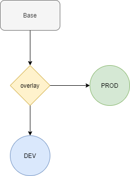

# Use kustomize for kubernetes deployment

kubectl with kustomize can have similar customized deployment.

This two deployments is one on prod and one on dev environment, using the tools-stash container image from dockerhub.

